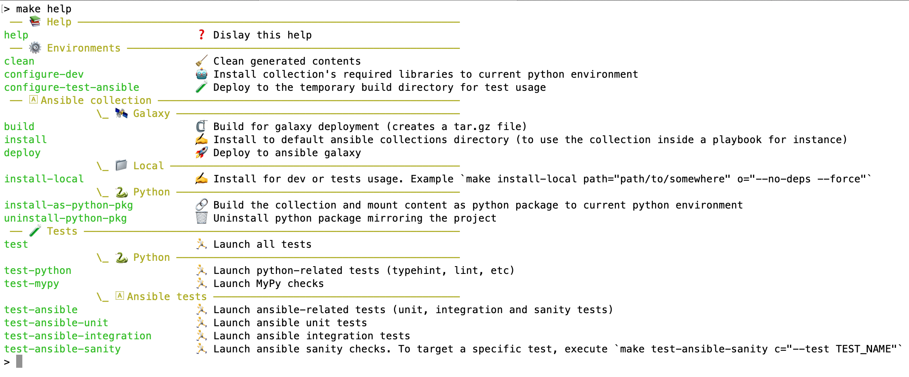
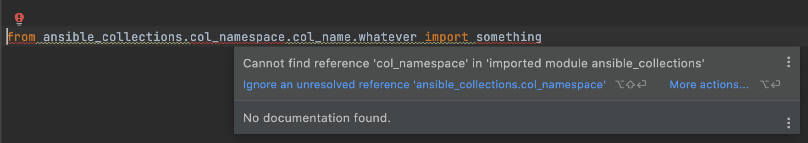

.. _ansible-collection-development-tips--tricks:

Ansible collection development tips & tricks
============================================

-  `Makefile`_
-  `Alternative to ansible galaxy`_

   -  `Github hosted collection`_
   -  `Locally hosted collection`_

-  `Installed ansible collections as python package`_

   -  `Install`_
   -  `Uninstall`_
   -  `Typical errors without mirroring`_

Makefile
--------

See `Makefile file <./Makefile>`_.

Overview
~~~~~~~~

Alternative to ansible galaxy
-----------------------------

In case you need to use a collection not hosted on ansible galaxy, see
below two ways

Github hosted collection
~~~~~~~~~~~~~~~~~~~~~~~~

Add the following in your ``galaxy.yml``

.. code:: yaml

   dependencies: 
     "git@github.com:__ORG__/__REPO__.git": "__VERSION__"

``__VERSION__`` may be a tag, a branch or commit

Locally hosted collection
~~~~~~~~~~~~~~~~~~~~~~~~~

Add the following in your ``galaxy.yml``

.. code:: yaml

   dependencies: 
     "__PATH_TO_THE_COLLECTION__": "__VERSION__"

``__VERSION__`` is a collection requirement spec (e.g. ``>=1.1.0<2.0.0``, ``*``, etc)

*N.B.: That way can be used to test a collection you are currently
developing/updating*

Installed ansible collections as python package
----------------------------------------------

Mirroring installed collections as python package allows, for instance,
IDE auto-completion.

In case you work with ``mypy``, and you use a typed collection
(``py.typed`` marker, stubs available, etc), mirroring ansible
collection will prevent ``mypy`` to yell about
``module is installed, but missing library stubs or py.typed marker``

Install
~~~~~~~

Go to ansible collections directory (usually ``~/.ansible/collections``) and execute
the following:

.. code:: bash

   python -c 'from setuptools import setup;setup(name="local-ansible-collections", version="0.0.0.dev0", package_dir={"": "."}, packages=["ansible_collections"])' develop

Command will create an egg which will mirror the directory to your current python ``site-packages``.

🎉 Any changes to the collection directory will be automatically reflected on python ``site-packages`` 
*Thanks to* ``develop`` *mode, which actually symlink the directory instead of installing the package*

*Target* ``install-as-python-pkg`` *from* `Makefile <./Makefile>`_ *uses the same approach*

Uninstall
~~~~~~~~~

.. code:: bash

   python -m pip uninstall local-ansible-collections

Typical errors without mirroring
~~~~~~~~~~~~~~~~~~~~~~~~~~~~~~~~

**MyPy**

.. code:: bash

   $ python -m mypy --config-file mypy.ini .
   plugins/action/my_action.py:10: error: Skipping analyzing "ansible_collections.col_namespace.col_name.whatever": module is installed, but missing library stubs or py.typed marker
   plugins/action/my_action.py:10: note: See https://mypy.readthedocs.io/en/stable/running_mypy.html#missing-imports
   Found 1 error in 1 file (checked 17 source files)

N.B.: Mirroring alone is not sufficient to fix the error, collection also need to contain either stubs or a ``py.typed`` marker

**IDE** (PyCharm in that case)

``Cannot find reference 'col_namespace' in 'imported module ansible_collections'``

